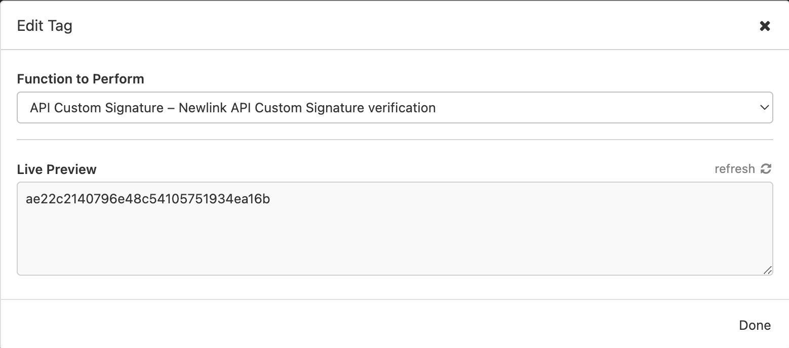
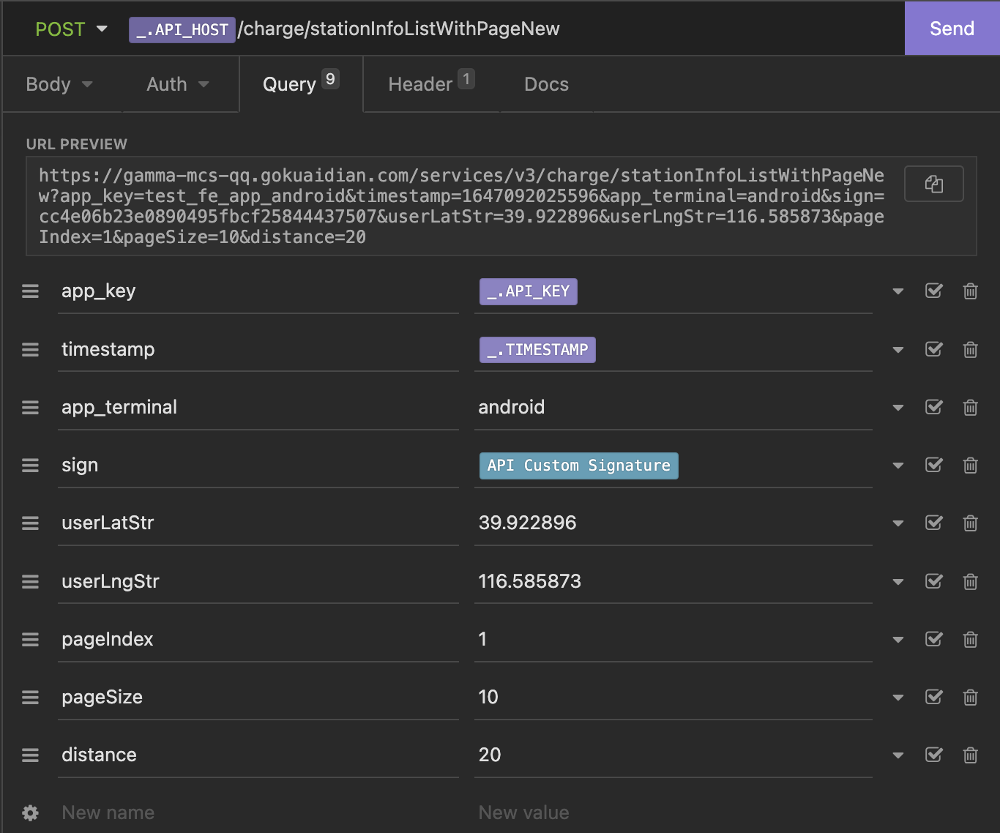

# insomnia-plugin-custom-signature

> Newlink API Custom Signature verification Insomnia Plugin

## 安装

[Insomnia Download](https://insomnia.rest/download/#mac)

下载 `Insomnia`， 进入`Insomnia Preferences -> Plugins` 安装插件

## 配置

在 `Manage Environment` 配置环境变量

``` json
{
  "API_KEY": "xxxxxxxxxxx",
  "API_SECRET": "xxxxxxxxxxx"
}
```



